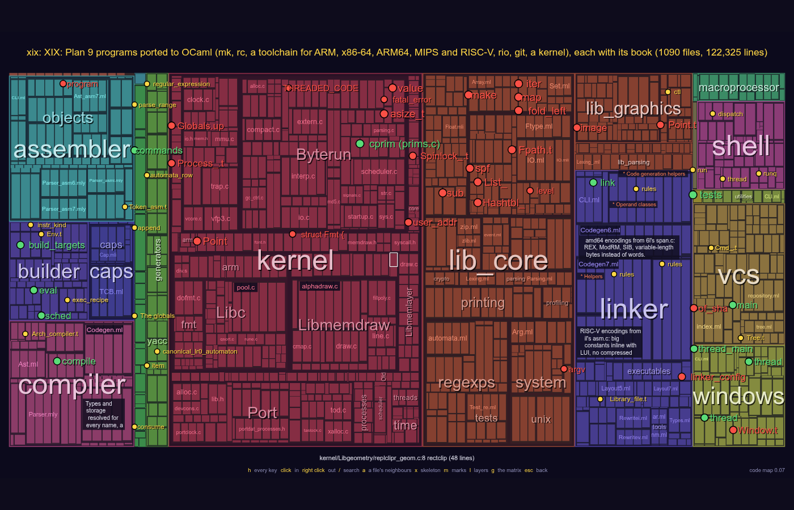
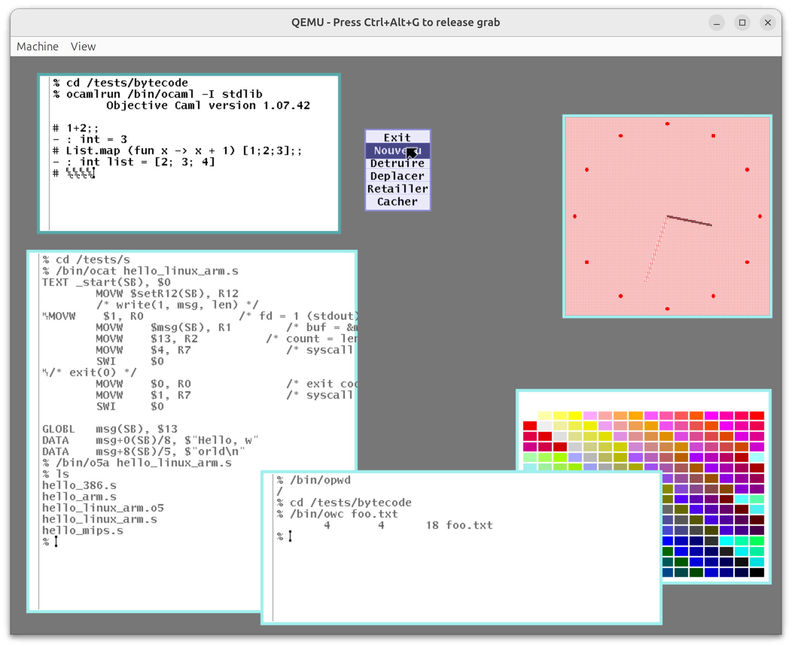

# XIX

**Plan 9 programs rewritten in OCaml: the build system, the shell, a C
compiler, an assembler and a linker, an editor, git, the windowing
system, and more.**

Website: **[aryx.github.io/xix](https://aryx.github.io/xix/)**, with a
[code map](https://aryx.github.io/xix/codemap.html) of the whole
repository to explore in the browser.

[](https://aryx.github.io/xix/codemap.html)

XIX is XIX: the first fully recursive acronym for a project. It is a
port of the C source code of the major
[Plan 9](https://en.wikipedia.org/wiki/Plan_9_from_Bell_Labs) programs
to [OCaml](https://ocaml.org/), and a companion to
[Principia Softwarica](https://principia-softwarica.org), a series of
literate programming books explaining Plan 9's source code: each
OCaml port has its own book.

It is not finished: some programs are mature (`omk` and `orc` build
XIX itself; `orio` can take the place of `rio` on Plan 9), others are
still being written.

## The programs

Lines are of OCaml; the ratio is how many lines of C the original has
for one of the port.

| program | what it is | ported from | lines | C/OCaml | code | book |
|---|---|---|---|---|---|---|
| **omk** | the build system | `mk` | 2,750 | 1.58 | [`builder/`](builder/) ([map](https://aryx.github.io/xix/codemap.html?focus=builder)) | [pdf](https://aryx.github.io/assets/pdfs/omk-1.pdf) |
| **orc** | the shell | `rc` | 2,150 | 3.04 | [`shell/`](shell/) ([map](https://aryx.github.io/xix/codemap.html?focus=shell)) | [pdf](https://aryx.github.io/assets/pdfs/orc-2.pdf) |
| **occ** | the C compiler | `5c` | 6,250 | 2.99 | [`compiler/`](compiler/) ([map](https://aryx.github.io/xix/codemap.html?focus=compiler)) | [pdf](https://aryx.github.io/assets/pdfs/occ-1.pdf) |
| **oas** | the assembler | `5a` | 1,750 | 2.04 | [`assembler/`](assembler/) ([map](https://aryx.github.io/xix/codemap.html?focus=assembler)) | [pdf](https://aryx.github.io/assets/pdfs/oas-1.pdf) |
| **olk** | the linker | `5l` | 2,650 | 2.84 | [`linker/`](linker/) ([map](https://aryx.github.io/xix/codemap.html?focus=linker)) | [pdf](https://aryx.github.io/assets/pdfs/olk-1.pdf) |
| **olex**, **oyacc** | the lexer and parser generators | `lex`, `yacc` | 3,500 | | [`generators/`](generators/) ([map](https://aryx.github.io/xix/codemap.html?focus=generators)) | [pdf](https://aryx.github.io/assets/pdfs/CompilerGenerator-3.pdf) |
| **oed** | the editor | `ed` | 1,500 | 1.06 | [`editor/`](editor/) ([map](https://aryx.github.io/xix/codemap.html?focus=editor)) | [pdf](https://aryx.github.io/assets/pdfs/Principia-9.pdf) |
| **ogit** | version control | git | 5,600 | | [`vcs/`](vcs/) ([map](https://aryx.github.io/xix/codemap.html?focus=vcs)) | [pdf](https://aryx.github.io/assets/pdfs/ogit-1.pdf) |
| **orio** | the windowing system | `rio` | 3,300 | 2.67 | [`windows/`](windows/) ([map](https://aryx.github.io/xix/codemap.html?focus=windows)) | [pdf](https://aryx.github.io/assets/pdfs/orio-1.pdf) |

The toolchain targets ARM, x86-64, ARM64, MIPS and RISC-V. There is
also a port of the Plan 9 kernel ([`kernel/`](kernel/)), which builds
only on Plan 9.

The same project, in repositories of their own:
[ocaml-light](https://github.com/aryx/ocaml-light), a simplified OCaml
compiler that runs OCaml programs on Plan 9;
[efuns](https://github.com/aryx/efuns), an Emacs clone;
[mmm](https://github.com/aryx/mmm), a web browser; and the Tiger and
C-- compilers ([fork-tiger](https://github.com/aryx/fork-tiger),
[fork-c--](https://github.com/aryx/fork-c--)).

## Why port Plan 9 to OCaml?

One way to understand a program well enough to explain it in a book
is to port it to another language. While porting, it is tempting to
skip what looks accessory; finding out what is essential already
teaches something, and the port that does not work at first, because
the "accessory" turned out to matter, shows the subtleties of the
original.

The ports are also useful by themselves. Unlike Plan 9's C code, most
of them run on Linux, macOS and Windows; the OCaml is about half the
size of the C, and has no segmentation fault or buffer overflow. It
became easier to try a new feature in OCaml first and port it back to
C later.

Here is `orio` running on Plan 9 in place of the original `rio`, its
windows showing `omk`, `orc`, `oas` and `olk` at work, all OCaml
programs run by ocaml-light's `ocamlrun`:



The [website](https://aryx.github.io/xix/) tells more, and the
[IWP9 paper](https://aryx.github.io/assets/pdfs/iwp9-xix.pdf)
describes the project.

## Building

XIX has two build systems side by side: dune, for development, and
`mk` (its own `omk`), which must always work without dune.

With dune (OCaml and opam; see [`install.txt`](install.txt) for the
packages):

```sh
make          # omk, orc, the toolchain, oed, ...
make test
```

With mk, from nothing:

```sh
./bootstrap-mk.sh    # builds bin/omk and bin/orc
source env.sh        # puts ./bin in the PATH
mk depend
mk
```

## AI disclaimer

About 95% of the code in this repository was written by humans (me,
Pad, and the authors of the OCaml standard library, Xavier Leroy et
al.). The rest was written by Claude Code, especially for the linker.

## License

LGPL 2.1 (see [`license.txt`](license.txt)).
